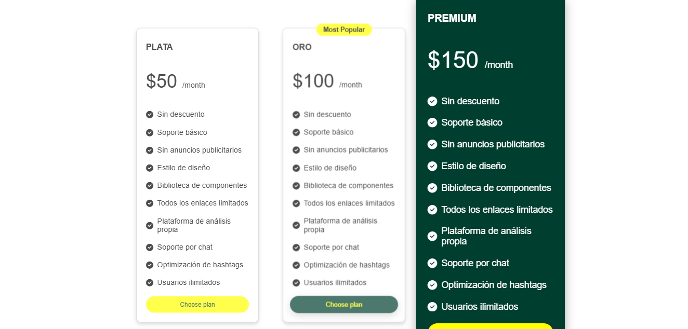

📌 Mockup1
Este proyecto es un diseño de interfaz que incluye animaciones, scripts y estilos para una plataforma interactiva.
Mi mayor desafío es lograr que sea una página resposiva. No lo logré pero aprendí mucho de los errores.
Link: https://sharairp.github.io/mockup1/

🚀 Características
✅ Diseño responsive con CSS y JavaScript.
✅ Animaciones y transiciones suaves.
✅ Organización modular de estilos y scripts.
✅ Compatibilidad con navegadores modernos.

📁 Estructura del proyecto

📦 uno
 ┣ 📂 imagen         # Contiene las imágenes utilizadas
 ┣ 📂 estilos        # Archivos CSS para los estilos
 ┣ 📂 scripts        # Archivos JS para la funcionalidad
 ┣ 📜 index.html     # Página principal
 ┗ 📜 README.md      # Este archivo de documentación
🖼️ Vista previa

📌 Tecnologías usadas
HTML5
CSS3 (Flexbox, Grid, Animaciones)
JavaScript (ES6+)
✨ Autor
👤 Sharai Rioja Perez

